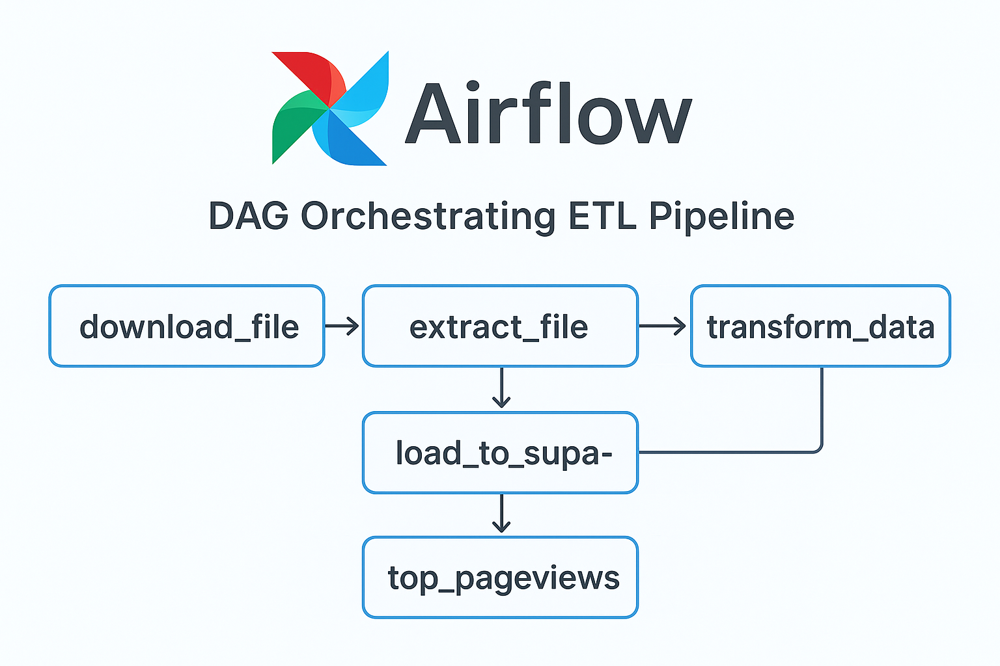
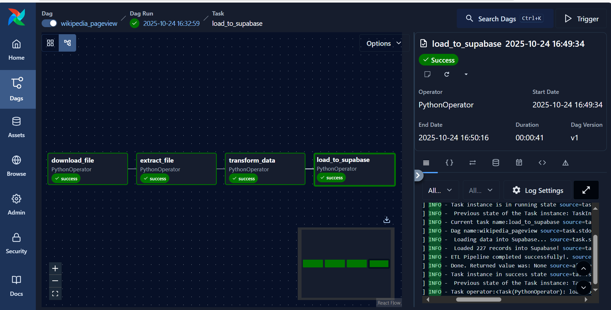

# Wikipedia Pageviews ETL Pipeline (Airflow + Supabase)

This project implements an **Apache Airflow–orchestrated ETL pipeline** that downloads, extracts, transforms, and loads Wikipedia pageview data into a Supabase PostgreSQL database.  
The pipeline focuses on five major tech companies — `Amazon`, `Apple`, `Facebook`, `Google`, and `Microsoft`.

##  Architecture Overview

**Workflow:**
1. **Download** a compressed pageview file from Wikimedia.
2. **Extract** the `.gz` file into plain text.
3. **Transform** and filter for target company pagesviews.
4. **Load** the processed data into the Supabase table `core_sentiment_pageviews`.
5. **Analyze** and Select the highest company's pageviews.

**Tech Stack**
- Apache Airflow
- Python (Requests, Pandas, SQLAlchemy)
- Supabase (PostgreSQL)
- Docker (for Airflow orchestration)

---

##  Airflow orchestrates the tasks in sequence as shown below:


---

##  Setup Instructions

### 1. Clone the Repository
```bash
git clone https://github.com/BidexTech/airflow-wikipedia-etl
cd airflow_test_scripts

# Create and or Activate Virtual Environment alrwady in your airflow 

python3 -m venv venv
source venv/bin/activate

# Install Dependencies
pip install -r requirements.txt

# Create a folder `data` in your sentiment folder to store sample of the below
  1.download zip_file : pageviews.gz
  2.unzip file        : filepageviews.txt
  3.transform_data    : filtered_views.csv

# Set Up Environment Variables and Create a .env file in the sentiment foler:

user=postgres
password=<YOUR_SUPABASE_PASSWORD>
host=<YOUR_SUPABASE_HOSTNAME>
port=5432
dbname=postgres
```
### 2. Run with Airflow
```bash
# Start Airflow if using docker compose

docker compose up -d --build

# Access the UI at: http://localhost:8080

# Trigger the DAG manually or wait for its daily schedule.

# If successful, you should somthing similar from log:

 Connection to Supabase Postgres successful!
 File downloaded and processed!
 Loading data into Supabase... source=task.stdout
 Loaded 227 records into Supabase! source=task.stdout
 ETL Pipeline completed successfully!
```

https://github.com/BidexTech/airflow-wikipedia-etl/blob/main/images/loaded_supabase_data.PNG
### Best Practices Implemented

1. Retries: DAG retries failed tasks up to 2 times.
2. Idempotence: Skips download if file already exists.
3. Failure Alerts: Email alert on failure.
4. Logging: Uses Airflow task logs for monitoring.

### Troubleshooting

1. Common error: ModuleNotFoundError for psycopg2 or sqlalchemy: install dependencies in the same Python environment Airflow runs in (use pip install -r requirements.txt).
2. Connection refused:  check Supabase network rules, IPv4 vs IPv6. Use Session Pooler (port 6543) if your environment only has IPv4.

## Future Enhancements

1. Add Slack alert integration.

2. Incremental loading (avoid full replace).

3. Store raw files in S3 or GCS.

Author

- Afeez Olasunkanmi
- Date Engineer
- olasunkanmiabidemia@gmail.com
- [LinkedIn](https://linkedin.com/in/afeez-olasunkanmi-874827236)
  


